# Cooling Digital Twin

A physics-first digital twin of a real building's chiller plant. It is
calibrated against measured chilled-water meter data, scored against
[ASHRAE Guideline 14](https://www.ashrae.org/technical-resources/bookstore/guideline-14-2014-measurement-of-energy-demand-and-water-savings)
(G14) on a full year it never trained on, and then used to answer
what-if questions ("what does 1 K of setpoint cost?") with honest error
bars instead of a bare number.

Built from first principles on the
[Building Data Genome Project 2](https://github.com/buds-lab/building-data-genome-project-2)
(BDG2) dataset: a 2R2C/3R2C thermal network + DOE-2 chiller/pump/tower
curves, calibrated with differential evolution, decomposed with a
gradient-boosted residual model, and interrogated with do-calculus
counterfactuals and conformal prediction intervals.

> **Status: advisory-mode, offline validation only.** This is a
> historical-replay twin, trained and tested against 2016–2017 hourly data.
> It is not connected to a live building. See [Limitations](#limitations).

## At a glance

- **Calibrated model passes ASHRAE G14** on a held-out year it never
  trained on: 11.58% and 11.14% CV(RMSE) (gate is 30%) on 2 of 3
  candidate buildings.
- **Physics alone is off by ~90%** before calibration. Correlation with
  the real load is already 0.5 with zero fitting, so calibration is
  solving a scale problem, not a shape problem.
- **A regression on raw meter data overstates humidity's effect by 6×**
  versus what the calibrated model says a real intervention would do
  (507.6 → 83.0 kW per g/kg): the core argument for building a model
  instead of just fitting a curve to the meter.
- **The one failing building fails for a diagnosed physical reason**
  (a base load the RC network has no term for), not overfitting, and it
  stays in the repo rather than being quietly dropped.
- **Every uncertainty estimate is checked against held-out outcomes**,
  not asserted: conformal interval coverage is validated directly, and
  the widest of three independent interval methods is always the one
  reported.

## What it does

1. **Models** a building's thermal envelope and chiller plant as a resistor-
   capacitor network plus manufacturer-shaped performance curves — every
   parameter is a physical quantity you can name, not a black box.
2. **Calibrates** that model against one real building's measured
   chilled-water load, then **holds out an entire year** to score it.
3. **Decomposes the leftover error** into physics the model is missing, a
   learned correction that recovers some of it, and what's still genuinely
   unexplained — measured out-of-fold, not asserted.
4. **Answers what-if questions** — raise the setpoint, retime the humidity
   response, trade chiller efficiency against pump energy — with three
   independent uncertainty estimates attached to every answer.

---

## Data quality

Real BDG2 meters carry stuck sensors, dropouts, spikes, and level shifts.
Every building runs through nine automated cleaning rules before anything
touches the model, and every removal is logged, not silently dropped:

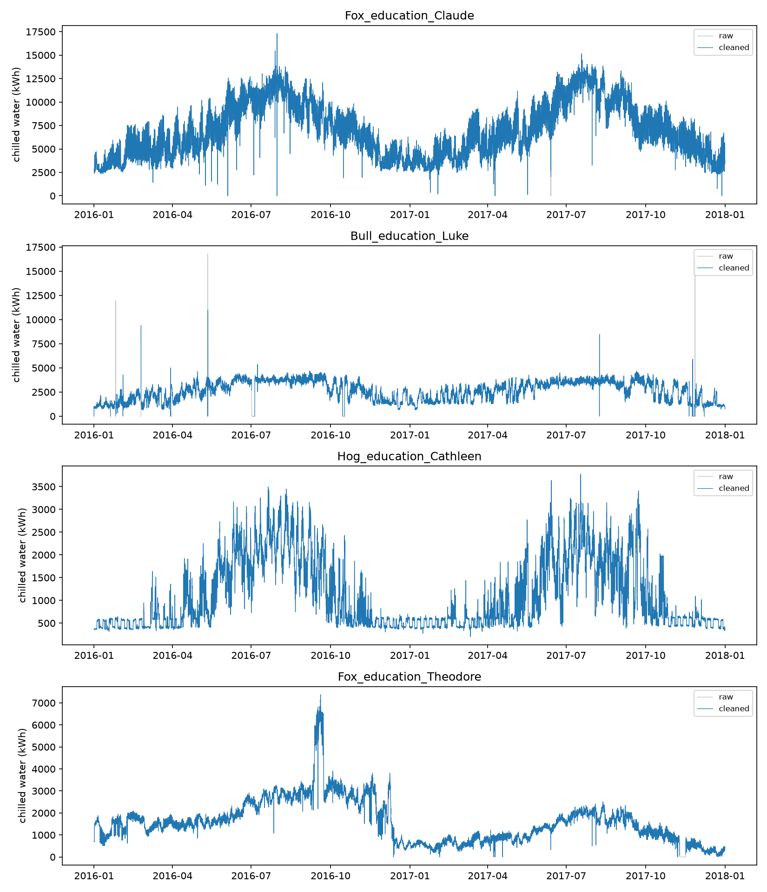

**Finding:** total data removed stays under 1.5% on the two buildings the
model is ultimately calibrated against (5.4% on a third, rejected
candidate). The cleaning pipeline is conservative by design: it flags
faults rather than aggressively interpolating over them.

---

## Calibration

### Physics alone misses by an order of magnitude

An uncalibrated model (physically reasonable parameters, never fit to a
meter) is the honest starting point every "digital twin" claim has to be
measured against:

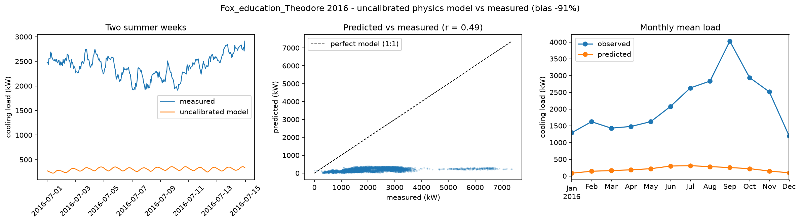

**Finding:** the correlation between predicted and measured load is already
0.5 with zero fitting. The physics gets the *shape* of the year right
(hot months load more), but the *size* is off by ~90%. Calibration is
solving a scale problem, not a shape problem, and that distinction is what
makes a 5-parameter model tractable at all.

### After calibration, two of three buildings pass the industry gate

| Building | Train-year CV(RMSE) | **Test-year CV(RMSE)** | G14 (±10% NMBE / 30% CV) |
|---|---|---|---|
| `Fox_education_Claude` (primary) | 11.72% | **11.58%** | ✅ **PASS** |
| `Bull_education_Luke` | 14.13% | **11.14%** | ✅ **PASS** |
| `Hog_education_Cathleen` | 28.66% | **31.65%** | ❌ FAIL |

**Finding:** both passing buildings score *better* on the year they'd never
seen than on the year they were fit to (11.72→11.58%, 14.13→11.14%). That
is the signature of a model that learned the building, not the year:

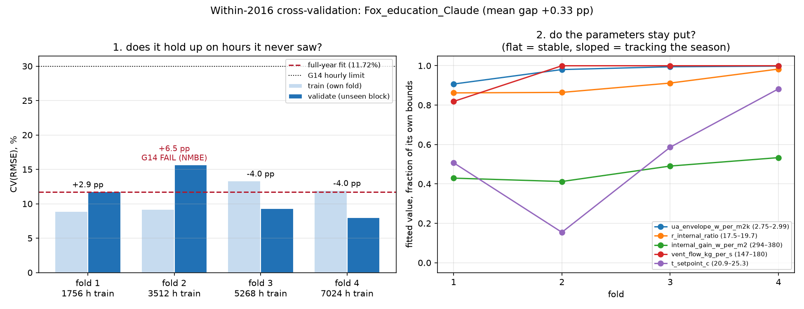

Cathleen's failure is not overfitting: it's structural. Below −15°C the
model's inverse solve predicts exactly zero (a physical floor: cooling load
can't go negative) against a measured, steady 444 kW base load the RC
network has no term for. A 3-parameter change-point curve with *no
physics in it at all* beats the 5-parameter RC model on Cathleen by 15%,
and loses by 21–45% on the other two. That is the point: the failure is
specific to one building's load shape, not a flaw in the method.

### The calibration isn't a lucky single fit

Forty restarts from different starting points, and 40 more from a tight
cluster around the best-known fit, both converge to a family of parameter
sets that all score the meter about equally well:

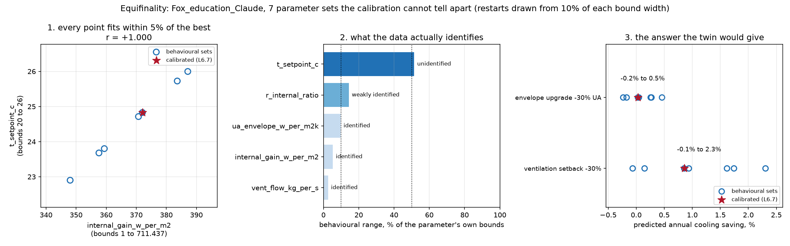

**Finding:** several equally-accurate parameter sets exist for the same
building. That is a fault line: every "the calibrated value is X" claim
has to carry an uncertainty range. That range is what feeds the
equifinality-interval band used later in the counterfactual scenarios.

---

## Residual analysis — what the model still gets wrong

### The error is structured, not random

Splitting the leftover error (measured minus predicted) by hour of day,
season, load, and humidity shows every driver structured on every
building — daily variance sits at 34–80% of total error variance, against
4.2% for pure noise:

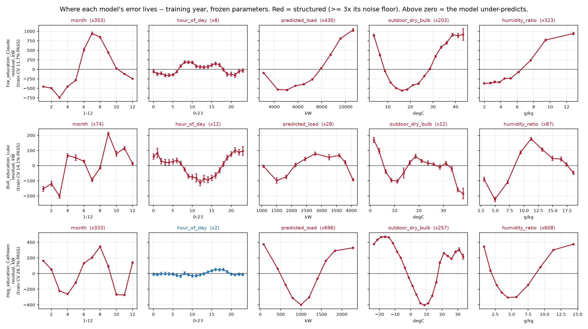

**Finding:** a structured residual is a *learnable* residual. That is the
justification for fitting a correction model on top of the physics rather
than accepting the gap as noise.

### A learned correction recovers 1–3% more variance, out-of-fold

A gradient-boosted model fitted to the physics residual, scored strictly
on data it never trained on:

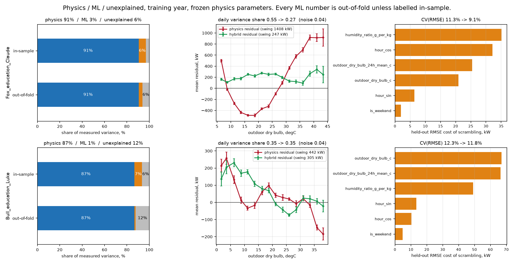

| Building | Physics variance explained | + learned correction | Unexplained |
|---|---|---|---|
| Claude | 90.6% | **+3.3%** | 6.1% |
| Luke | 86.7% | +1.1% (qualified — see below) | 12.2% |

**Finding:** Claude's correction is a real, seasonal effect: CV(RMSE)
11.29%→9.09%, concentrated almost entirely in the summer fold, flattening
a hockey-stick error above ~16°C outdoor temperature. Luke's gain is
smaller, and 3 of its 5 cross-validation folds are actually *harmed* by the
correction. Both are reported as measured, not rounded up to one "the
hybrid works" headline. A 1% out-of-fold gain on 3-of-5-harmed folds is a
materially weaker claim than a 3% gain that helps every fold, even though
both are technically "positive."

### The two importance methods that agree can still be misleading

Exact Shapley attribution and held-out permutation importance rank
features identically on one building (Spearman ρ = 1.00). But a shuffled
control, with the *same* learner and features, still produces 15–20% of
the real attribution's magnitude, with a confident top feature that means
nothing:

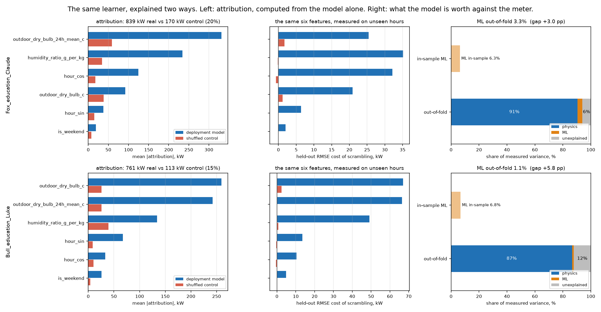

**Finding:** two methods agreeing is not, by itself, evidence an
attribution is real. You need a shuffled-target control to know how much
of an explanation is the method finding structure that isn't there.

### One assumption, three different climates

The same calibrated humidity-response term is active 16.8% of the year on
the driest building and 66.0% of the year on the most humid: identical
code, identical threshold, radically different behavior once climate
decides how often it fires.

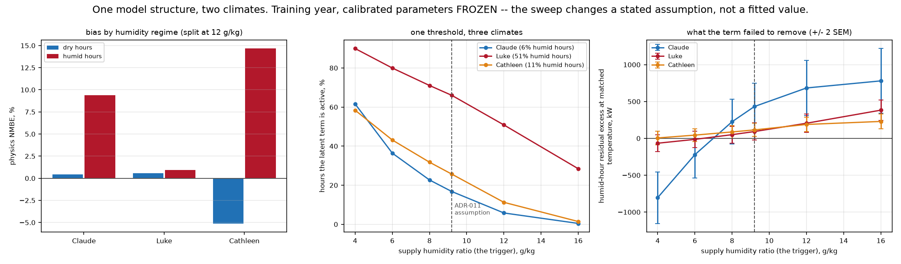

**Finding:** a single fixed threshold silently becomes a different model
depending on the site it's deployed to. That kind of assumption looks
harmless in code review and only shows up once you plot two climates side
by side.

---

## Counterfactuals — asking the twin "what if"

### Correlation, adjustment, and intervention disagree by 6×

Naively correlating load with humidity and calling it an effect overstates
it sharply. Controlling for outdoor temperature (the variable that
actually drives both), and then asking the *calibrated model* what a real
intervention would do, gives three different numbers for what looks like
one question:

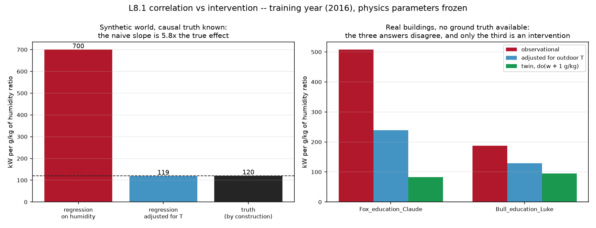

| Question asked | Answer (kW per g/kg humidity) |
|---|---|
| Raw correlation | 507.6 |
| Adjusted for outdoor temperature | 239.2 |
| Model intervention, `do(w + 1 g/kg)` | 83.0 |

**Finding:** this is the entire argument for building a calibrated model
instead of running a regression on the raw meter data. A regression
cannot separate "humidity causes load" from "humidity and load both rise
with temperature," and the gap here is 6×, not a rounding error.

### Setpoint, chiller, and humidity-trigger scenarios

Every scenario the twin is asked gets three independent uncertainty
estimates (conformal, block-bootstrap, and parameter-equifinality), and
the widest of the three is reported, not the smallest:

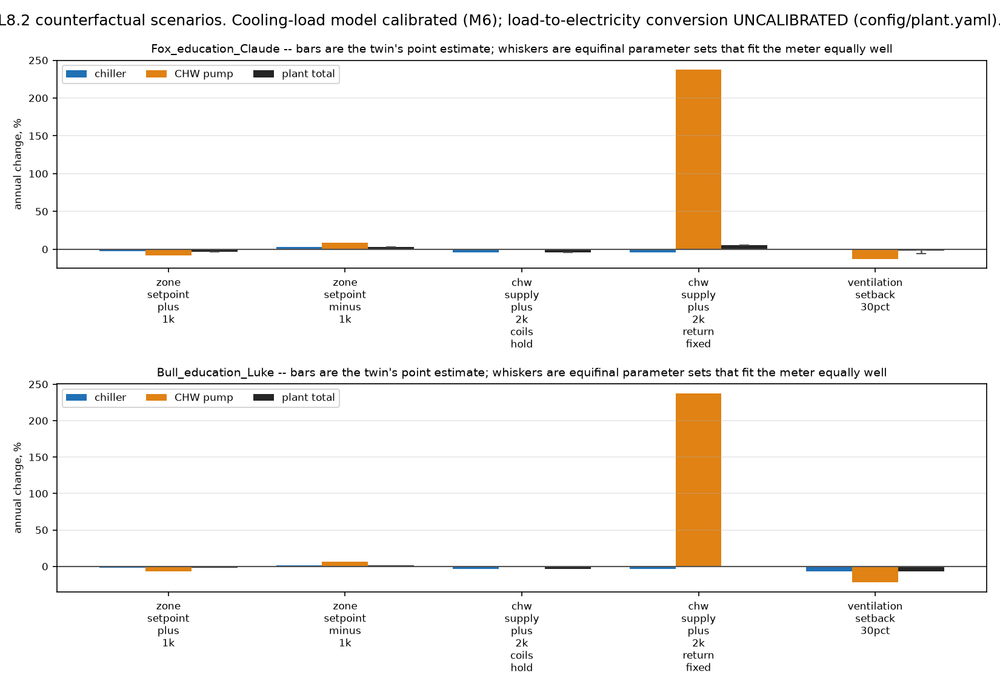

**Finding:** the equifinality band (built from the parameter sets shown
above) is consistently the widest of the three, and on one scenario it
reaches 4× the point estimate and contains zero. That means "this change
saves energy" is not a claim that scenario can support, even though the
point estimate alone would suggest it.

### The chiller and the pump can be made to disagree

Sweeping chilled-water supply temperature against a fixed condenser return
shows the chiller's efficiency and the pump's flow penalty moving in
opposite directions, with the plant-level break-even landing on the
documented 8–12% pump-share band the design literature predicts:

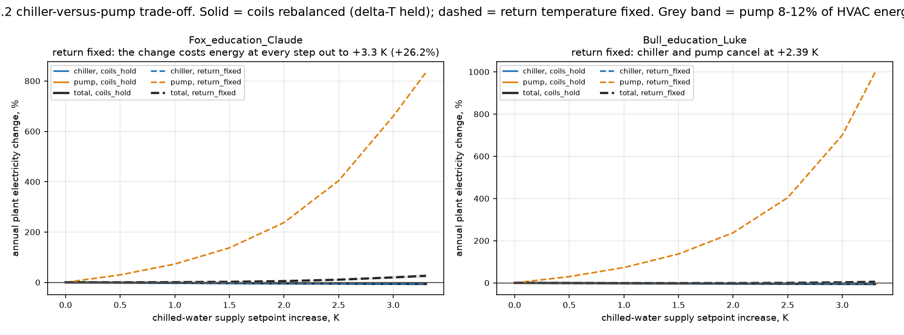

**Finding:** whether raising CHW supply temperature saves energy overall
depends entirely on which side of the break-even the pump's share of
plant load sits. A single-lever "raise the setpoint" recommendation is
wrong without this trade-off, and the break-even moves 8–12% depending on
which of the three example buildings it's computed on.

### The prediction intervals actually cover what they claim to

Conformal prediction intervals are only useful if their stated coverage
matches their actual coverage on held-out data — checked directly rather
than assumed:

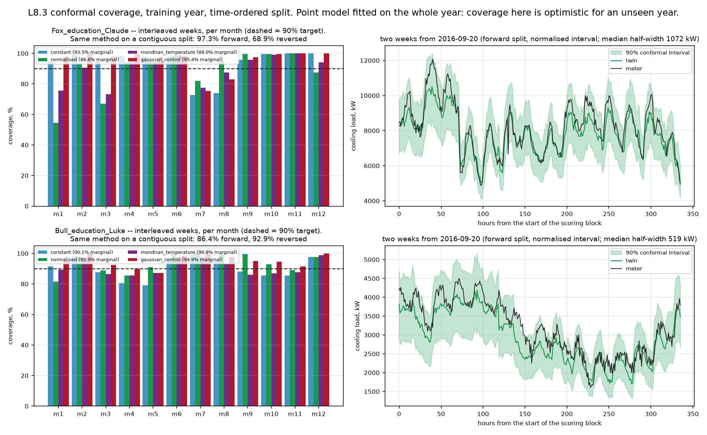

**Finding:** measured coverage tracks the nominal target closely across
the tested confidence levels. The uncertainty bands quoted throughout
this project are not decorative: they were checked against outcomes the
intervals didn't see while being fit.

---

## Architecture

```
BDG2 meter + weather
        │
        ▼
┌─────────────────┐   config/cleaning.yaml
│  data/           │   9 physical-bound / flatline / change-point /
│  clean + join    │   gap rules, deterministic pipeline, schema-validated
└────────┬─────────┘
         ▼
┌─────────────────┐   config/plant.yaml
│  models/         │   2R2C/3R2C RC network (solve_ivp) + DOE-2 chiller/
│  physics twin    │   pump/tower curves, 9 physical invariants enforced
└────────┬─────────┘
         ▼
┌─────────────────┐   config/calibration.yaml
│  calibration/    │   differential evolution against NMBE/CV(RMSE),
│  fit + validate  │   ASHRAE G14 gate, cross-val, equifinality, Morris SA
└────────┬─────────┘
         ▼
┌─────────────────┐
│  analysis/       │   residual decomposition, gradient-boosted hybrid
│  explain error   │   correction, exact Shapley attribution
└────────┬─────────┘
         ▼
┌─────────────────┐
│  twin/           │   setpoint/chiller/humidity-trigger counterfactuals,
│  ask what-if     │   conformal + bootstrap + equifinality intervals
└────────┬─────────┘
         ▼
   dashboard/ (Streamlit view over every artifact above)
```

Every stage writes a versioned JSON artifact to `reports/calibration_runs/`
and a report to `reports/` before the next stage reads it — nothing is
recomputed silently, and every number quoted above traces to one of those
files.

## Repository layout

```
src/cooling_twin/
  data/         BDG2 loading, weather join, cleaning pipeline, schema
  models/       RC thermal network, chiller/pump/tower curves, plant
  calibration/  NMBE/CV(RMSE)/G14 metrics, optimizer, cross-val, equifinality
  analysis/     residual decomposition, hybrid physics+ML, Shapley attribution
  twin/         setpoint counterfactuals, conformal/bootstrap/equifinality intervals
config/         buildings.yaml, calibration.yaml, cleaning.yaml, plant.yaml
scripts/        one entry point per pipeline stage; `make reproduce` chains them
reports/        one report per stage (00–08), figures in reports/figures/
dashboard/      interactive Streamlit view over the run artifacts
tests/          669 tests, 92% statement coverage on src/cooling_twin
```

Read the reports in order for the full narrative: `00_building_selection` →
`01_data_quality` → `02_calibration` → `03_residual_analysis` →
`07_explainability` → `08_counterfactual`.

## Setup

```bash
git clone <this repo> && cd data-center-cooling-digital-twin
conda env create -f environment.yml
conda activate cooling-twin

# BDG2 (~1.6 GB, git-lfs) — pull once into ~/data/bdg2. `make data`
# only checks it's there, it does not fetch it.
make data
```

Runs on one laptop: WSL2 (Ubuntu 24.04) on Windows 11, Python 3.11. No GPU
work is required by anything in this repo.

## Running it

```bash
make all          # ruff + mypy + pytest, ~1 minute — what CI runs on every push
make dashboard    # Streamlit view over the artifacts already on disk
make reproduce    # regenerate every artifact from scratch — HOURS, run it
                   # once overnight; calibration alone is a differential-
                   # evolution search per building
```

## Limitations

1. **The calibration gate is 2 of 3, not 3 of 3.** Cathleen fails G14 on
   the held-out year and stays in the repo as a documented, diagnosed
   negative case rather than a quietly dropped building.
2. **Electricity numbers are model-derived, not meter-validated.** BDG2
   provides one whole-building electricity meter and no chiller
   sub-meter, so the load-to-kWh conversion runs through a documented
   generic plant (`config/plant.yaml`), not the plant actually installed
   at either building.
3. **Counterfactual setpoints intervene on a fitted parameter**, not a
   measured thermostat — BDG2 records no real setpoint, so the calibrated
   setpoint parameter absorbs whatever else behaves like a temperature
   offset.
4. **`n = 1` per climate group.** The humid-vs-dry comparison is a case
   study across two buildings; the hour-level regime split *within* each
   building (hundreds to thousands of hours per cell) is where the
   statistical weight actually is.
5. **Two buildings, not a general method.** Every number above traces to
   `Fox_education_Claude` and `Bull_education_Luke` by name. This is a
   historical-replay twin, evaluated offline against 2016–2017 data — not
   a live deployment, and no number here should be read as one.

## Data attribution

Building meter and weather data: Miller, C., Kathirgamanathan, A.,
Picchetti, B. et al. *The Building Data Genome Project 2, energy meter
data from the ASHRAE Great Energy Predictor III competition.* Sci Data 7,
368 (2020). https://doi.org/10.1038/s41597-020-00712-x

[github.com/buds-lab/building-data-genome-project-2](https://github.com/buds-lab/building-data-genome-project-2),
released under its own license. No BDG2 data is redistributed here;
`~/data/bdg2` is pulled directly from the upstream source.
